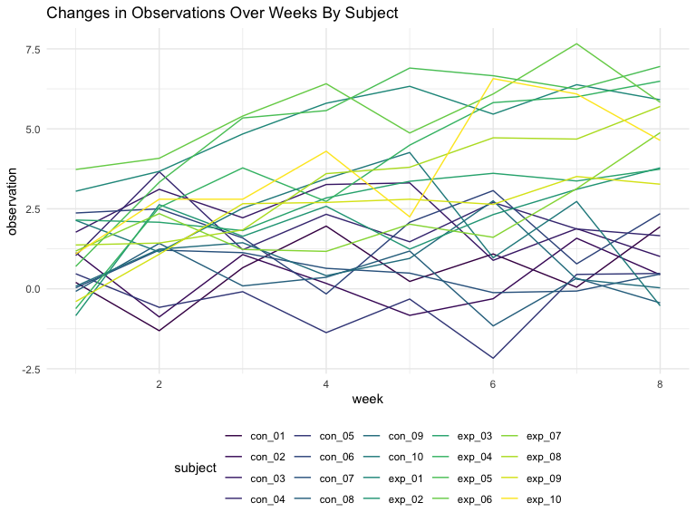

p8105\_hw5\_rt2640
================

``` r
library(tidyverse)
```

    ## ── Attaching packages ─────────────────────────────────────── tidyverse 1.3.1 ──

    ## ✓ ggplot2 3.3.5     ✓ purrr   0.3.4
    ## ✓ tibble  3.1.4     ✓ dplyr   1.0.7
    ## ✓ tidyr   1.1.3     ✓ stringr 1.4.0
    ## ✓ readr   2.0.1     ✓ forcats 0.5.1

    ## ── Conflicts ────────────────────────────────────────── tidyverse_conflicts() ──
    ## x dplyr::filter() masks stats::filter()
    ## x dplyr::lag()    masks stats::lag()

``` r
library(rvest)
```

    ## 
    ## Attaching package: 'rvest'

    ## The following object is masked from 'package:readr':
    ## 
    ##     guess_encoding

``` r
knitr::opts_chunk$set(
    echo = TRUE,
    fig.width = 8, 
  fig.height = 6,
  out.width = "90%"
)
options(
  ggplot2.continuous.colour = "viridis",
  ggplot2.continuous.fill = "viridis"
)
scale_colour_discrete = scale_colour_viridis_d
scale_fill_discrete = scale_fill_viridis_d
theme_set(theme_minimal() + theme(legend.position = "bottom"))
```

### Problem 2

``` r
study_tidy = function(arm) {
  
  x = read_csv(arm)
  
  x %>% 
    janitor::clean_names() %>% 
    pivot_longer(
      week_1:week_8,
      names_to = "week",
      values_to = "observation"
      )
  
}
```

``` r
study = 
  tibble(
    subject = str_c("./data/",list.files("./data"))
  ) %>% 
  mutate(
    output = map(subject, study_tidy),
    subject = str_remove(subject,"./data/"),
    subject = str_remove(subject,".csv"),
  ) %>% 
  unnest(output) %>% 
  #separate(subject,c("group","subject")) %>% 
  mutate(
    week = str_remove(week,"week_"),
    week = as.numeric(week)
  )
```

``` r
study %>%  
  ggplot(aes(x = week,y=observation,color=subject)) +
  geom_line() +
  labs(
    title = "Changes in Observations Over Weeks By Subject")
```



This plot makes it hard to separate the groups to see the trends so I
faceted the plot into the two arms.

``` r
study2 = study %>% 
  mutate(
   arm = subject,
  ) %>% 
  separate(arm,"arm",sep = "_")
  
study2 %>%  
  ggplot(aes(x = week,y=observation,color=subject)) +
  geom_line() +
  facet_grid(~arm) +
  labs(
    title = "Changes in Observations Over Weeks By Subject and Group")
```


This chart lets us see that the experimental arm’s observational data is
increasing in value over the weeks whereas the values are mostly
constant in the control arm. We do not know what the data describes so
we cannot determine if this is a good change or not.

### Problem 3

``` r
set.seed(10)

iris_with_missing = iris %>% 
  map_df(~replace(.x, sample(1:150, 20), NA)) %>%
  mutate(Species = as.character(Species))
```

``` r
fill_in = function(x) {
  
  if (!is.numeric(x)) {
    replace_na(x,"virginica")
  } else if (is.numeric(x)) {
    replace_na(x,mean(x,na.rm = TRUE))
  }
  
}
```

``` r
iris_full = map(iris_with_missing,fill_in)
```
