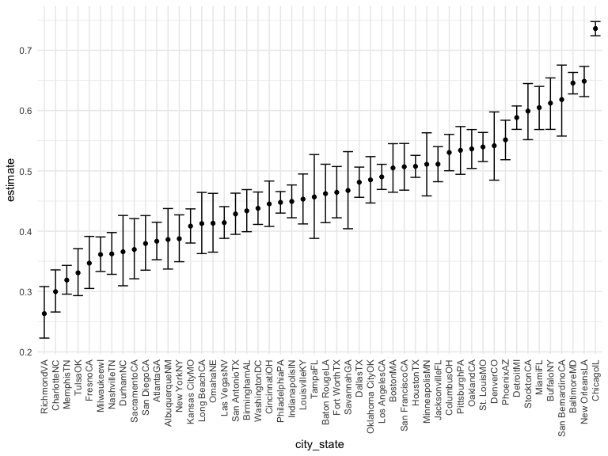
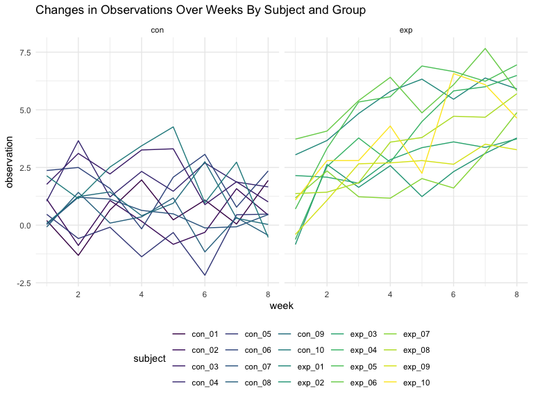

p8105\_hw5\_rt2640
================

``` r
library(tidyverse)
```

    ## ── Attaching packages ─────────────────────────────────────── tidyverse 1.3.1 ──

    ## ✓ ggplot2 3.3.5     ✓ purrr   0.3.4
    ## ✓ tibble  3.1.4     ✓ dplyr   1.0.7
    ## ✓ tidyr   1.1.3     ✓ stringr 1.4.0
    ## ✓ readr   2.0.1     ✓ forcats 0.5.1

    ## ── Conflicts ────────────────────────────────────────── tidyverse_conflicts() ──
    ## x dplyr::filter() masks stats::filter()
    ## x dplyr::lag()    masks stats::lag()

``` r
knitr::opts_chunk$set(
    echo = TRUE,
    fig.width = 8, 
  fig.height = 6,
  out.width = "90%"
)
options(
  ggplot2.continuous.colour = "viridis",
  ggplot2.continuous.fill = "viridis"
)
scale_colour_discrete = scale_colour_viridis_d
scale_fill_discrete = scale_fill_viridis_d
theme_set(theme_minimal() + theme(legend.position = "bottom"))
```

### Problem 1

``` r
homicide_df = 
  read_csv("./Data1/homicide_data.csv", na = c("","Unknown")) %>%
  mutate(
    city_state = str_c(city, state) ,
    resolution = case_when(
      disposition == "Closed without arrest" ~ "unsolved",
      disposition == "Open/No arrest" ~ "unsolved",
      disposition == "Closed by arrest" ~ "solved")
    ) %>%
  relocate(city_state) %>%
  filter(city_state != "TulsaAL")
```

    ## Rows: 52179 Columns: 12

    ## ── Column specification ────────────────────────────────────────────────────────
    ## Delimiter: ","
    ## chr (8): uid, victim_last, victim_first, victim_race, victim_sex, city, stat...
    ## dbl (4): reported_date, victim_age, lat, lon

    ## 
    ## ℹ Use `spec()` to retrieve the full column specification for this data.
    ## ℹ Specify the column types or set `show_col_types = FALSE` to quiet this message.

Let’s focus on Baltimore, MD

``` r
baltimore_df =
  homicide_df %>%
  filter(city_state == "BaltimoreMD")

baltimore_summary =
  baltimore_df %>%
  summarize(
    unsolved = sum(resolution == "unsolved"),
    n = n()
  )

baltimore_test =
  prop.test(
  x = baltimore_summary %>% pull(unsolved),
  n = baltimore_summary %>% pull(n))

baltimore_test %>%
  broom::tidy()
```

    ## # A tibble: 1 × 8
    ##   estimate statistic  p.value parameter conf.low conf.high method    alternative
    ##      <dbl>     <dbl>    <dbl>     <int>    <dbl>     <dbl> <chr>     <chr>      
    ## 1    0.646      239. 6.46e-54         1    0.628     0.663 1-sample… two.sided

Iterate across cities

``` r
prop_test_function = function(city_df) {
  city_summary =
  city_df %>%
  summarize(
    unsolved = sum(resolution == "unsolved"),
    n = n()
  )

city_test =
prop.test(
  x = city_summary %>% pull(unsolved),
  n = city_summary %>% pull(n))

return(city_test)

}

prop_test_function(baltimore_df)
```

    ## 
    ##  1-sample proportions test with continuity correction
    ## 
    ## data:  city_summary %>% pull(unsolved) out of city_summary %>% pull(n), null probability 0.5
    ## X-squared = 239.01, df = 1, p-value < 2.2e-16
    ## alternative hypothesis: true p is not equal to 0.5
    ## 95 percent confidence interval:
    ##  0.6275625 0.6631599
    ## sample estimates:
    ##         p 
    ## 0.6455607

``` r
homicide_df  %>%
  filter(city_state == "AlbuquerqueNM") %>%
  prop_test_function
```

    ## 
    ##  1-sample proportions test with continuity correction
    ## 
    ## data:  city_summary %>% pull(unsolved) out of city_summary %>% pull(n), null probability 0.5
    ## X-squared = 19.114, df = 1, p-value = 1.232e-05
    ## alternative hypothesis: true p is not equal to 0.5
    ## 95 percent confidence interval:
    ##  0.3372604 0.4375766
    ## sample estimates:
    ##         p 
    ## 0.3862434

Iterate across all cities

``` r
results_df =
  homicide_df %>%
  nest(data = uid:resolution) %>%
  mutate(
    test_results = map(data, prop_test_function),
    tidy_results = map(test_results, broom::tidy)
  ) %>%
  select(city_state, tidy_results) %>%
  unnest(tidy_results) %>%
  select(city_state, estimate, starts_with("conf"))
```

Plot showing estimates and confidence intervals.

``` r
results_df %>%
  mutate(city_state = fct_reorder(city_state, estimate)) %>%
  ggplot(aes(x = city_state, y = estimate)) +
  geom_point() +
  geom_errorbar(aes(ymin = conf.low, ymax = conf.high)) +
  theme(axis.text.x = element_text(angle = 90, vjust = 0.5, hjust = 1))
```



### Problem 2

``` r
study_tidy = function(arm) {
  
  x = read_csv(arm)
  
  x %>% 
    janitor::clean_names() %>% 
    pivot_longer(
      week_1:week_8,
      names_to = "week",
      values_to = "observation"
      )
  
}
```

``` r
study = 
  tibble(
    subject = str_c("./data/",list.files("./data"))
  ) %>% 
  mutate(
    output = map(subject, study_tidy),
    subject = str_remove(subject,"./data/"),
    subject = str_remove(subject,".csv"),
  ) %>% 
  unnest(output) %>% 
  #separate(subject,c("group","subject")) %>% 
  mutate(
    week = str_remove(week,"week_"),
    week = as.numeric(week)
  )
```

``` r
study %>%  
  ggplot(aes(x = week,y = observation,color = subject)) +
  geom_line() +
  labs(
    title = "Changes in Observations Over Weeks By Subject")
```


This plot makes it hard to separate the groups to see the trends so I
faceted the plot into the two arms.

``` r
study2 = study %>% 
  mutate(
   arm = subject,
  ) %>% 
  separate(arm,"arm",sep = "_")
  
study2 %>%  
  ggplot(aes(x = week,y = observation,color = subject)) +
  geom_line() +
  facet_grid(~arm) +
  labs(
    title = "Changes in Observations Over Weeks By Subject and Group")
```



This chart lets us see that the experimental arm’s observational data is
increasing in value over the weeks whereas the values are mostly
constant in the control arm. We do not know what the data describes so
we cannot determine if this is a good change or not.

### Problem 3

``` r
set.seed(10)

iris_with_missing = iris %>% 
  map_df(~replace(.x, sample(1:150, 20), NA)) %>%
  mutate(Species = as.character(Species))
```

``` r
fill_in = function(x) {
  
  if (!is.numeric(x)) {
    replace_na(x,"virginica")
  } else if (is.numeric(x)) {
    replace_na(x,mean(x,na.rm = TRUE))
  }
  
}
```

``` r
iris_full = map(iris_with_missing,fill_in)
```
